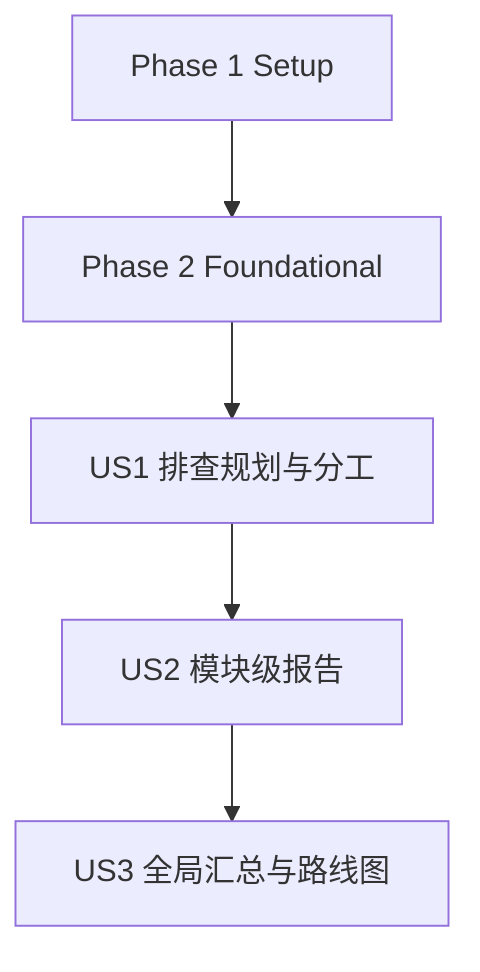

# Tasks: 代码质量排查与复用治理（分模块）

**输入**：`specs/001-code-quality-audit/`（本机绝对路径：`/home/tzw/workspace/DDPlayTV/specs/001-code-quality-audit/`）  
**前置文档**：`plan.md`（必需）、`spec.md`（必需）、`research.md`、`data-model.md`、`quickstart.md`、`contracts/openapi.yaml`

**测试**：本特性以文档规划/治理产出为主，不要求新增自动化测试；用 Gradle 门禁任务作为一致性校验，并把输出记录到 `document/code_quality_audit/runlogs/`。

**组织方式**：按 `spec.md` 的 User Story 分组，保证每个 Story 都可以独立推进与验收（尤其是 US2：单模块报告可独立验收）。

## 任务格式（强制）

`- [ ] T### [P?] [US?] 用一句话描述要做什么，并包含明确的文件路径`

- `[P]`：可并行执行（不同文件、无未完成依赖）
- `[US#]`：仅用于 User Story 阶段任务（US1/US2/US3）；Setup/Foundational/Polish 阶段不写

## 路径与命名约定

- 本特性新增/维护的主要产出放在：`document/code_quality_audit/`
- 模块报告文件命名：为兼容 Windows（避免 `:`），将 Gradle module path 转为文件名：
  - 去掉开头 `:`；其余 `:` 替换为 `__`
  - 例：`:player_component` → `player_component.md`；`:repository:danmaku` → `repository__danmaku.md`

---

## Phase 1：Setup（共享基础目录）

**目的**：建立文档落点与目录索引，避免后续产出分散

- [X] T001 创建审计文档入口与目录说明：`document/code_quality_audit/README.md`
- [X] T002 [P] 创建模板目录说明：`document/code_quality_audit/templates/README.md`
- [X] T003 [P] 创建运行记录说明（含 adb logcat 过滤规范）：`document/code_quality_audit/runlogs/README.md`
- [X] T004 [P] 创建模块报告目录说明（含文件命名规则）：`document/code_quality_audit/modules/README.md`

---

## Phase 2：Foundational（阻塞性前置：口径/模板/配置）

**目的**：统一范围、口径、模板与基础配置；完成后才能开始 US1/US2/US3 的稳定协作

**⚠️ 注意**：US2/US3 依赖本阶段产出（模块分组、ID 规则、模板、状态表）

- [X] T005 生成并固化模块分组配置（对齐 `settings.gradle.kts`）：`document/code_quality_audit/config/module_groups.yaml`
- [X] T006 [P] 生成并固化模块 ID 前缀映射（用于 `<MODULE>-F###/<MODULE>-T###`）：`document/code_quality_audit/config/module_id_prefixes.yaml`
- [X] T007 [P] 固化统一排查维度与证据标准（对齐 FR-002/FR-004）：`document/code_quality_audit/config/audit_dimensions.md`
- [X] T008 [P] 固化优先级矩阵与打分依据（对齐 FR-011/决策 6）：`document/code_quality_audit/config/priority.md`
- [X] T009 [P] 抽取并固化“模块报告模板”（从 `specs/001-code-quality-audit/quickstart.md` 提炼）：`document/code_quality_audit/templates/module_report.md`
- [X] T010 [P] 抽取并固化“全局汇总模板”（从 `specs/001-code-quality-audit/quickstart.md` 提炼）：`document/code_quality_audit/templates/global_summary.md`
- [X] T011 建立模块覆盖率/状态跟踪表（含 owner/status/reportPath）：`document/code_quality_audit/global/module_status.md`
- [X] T012 [P] 新增初始化脚本：从 `settings.gradle.kts` 生成/更新模块报告骨架与状态表：`scripts/code_quality_audit/init_audit_docs.py`
- [X] T013 执行初始化脚本并记录输出（同时更新 `document/code_quality_audit/modules/*.md` 与 `document/code_quality_audit/global/module_status.md`）：`document/code_quality_audit/runlogs/init_audit_docs.md`

**Checkpoint**：Foundational ready（口径统一 + 模板可复制 + 模块清单可追踪）

---

## Phase 3：User Story 1 - 制定可执行的排查规划与分工（Priority: P1）🎯 MVP

**目标**：产出一份可直接用于分工与开干的规划包：范围/分组/维度/模板/优先级/节奏/分工一体化

**独立验收**：仅完成本阶段即可验收——团队能按 `module_status.md` 分工，且所有模块报告遵循同一模板与口径

- [X] T014 [US1] 输出统一“排查规划”主文档（链接到配置/模板/门禁/分工）：`document/code_quality_audit/plan.md`
- [X] T015 [US1] 填写每个模块的负责人/状态/预计完成时间，并明确“观察项”策略：更新 `document/code_quality_audit/global/module_status.md`
- [X] T016 [P] [US1] 建立“观察项（Out of Build Scope）”清单（非构建目录/历史目录/第三方拷贝等）：`document/code_quality_audit/global/observing.md`
- [X] T017 [US1] 建立模块报告复核清单（证据/多实现分类/结论/优先级矩阵/依赖治理）：`document/code_quality_audit/global/review_checklist.md`
- [X] T018 [US1] 执行一次基础门禁并记录结果（必须确认 `BUILD SUCCESSFUL`）：`document/code_quality_audit/runlogs/foundation_gates.md`

**Checkpoint**：US1 Ready（可分工、可开工、口径不漂移）

---

## Phase 4：User Story 2 - 输出模块级排查报告（Priority: P2）

**目标**：为每个模块输出可追溯、可汇总的模块报告（含 Findings 与 Refactor Tasks）

**独立验收**：任选一个模块完成其报告即可验收——报告包含必需栏目，且至少产出 1 条可执行治理任务

> 说明：以下任务原则上都可并行（不同模块不同文件），但每个模块报告必须引用统一口径（维度/优先级/证据标准）并同步状态表。

- [ ] T019 [P] [US2] 完成模块排查报告 `:core_contract_component`：`document/code_quality_audit/modules/core_contract_component.md`（同步 `document/code_quality_audit/global/module_status.md`）
- [ ] T020 [P] [US2] 完成模块排查报告 `:core_log_component`：`document/code_quality_audit/modules/core_log_component.md`（同步 `document/code_quality_audit/global/module_status.md`）
- [ ] T021 [P] [US2] 完成模块排查报告 `:core_system_component`：`document/code_quality_audit/modules/core_system_component.md`（同步 `document/code_quality_audit/global/module_status.md`）
- [ ] T022 [P] [US2] 完成模块排查报告 `:core_network_component`：`document/code_quality_audit/modules/core_network_component.md`（同步 `document/code_quality_audit/global/module_status.md`）
- [ ] T023 [P] [US2] 完成模块排查报告 `:core_database_component`：`document/code_quality_audit/modules/core_database_component.md`（同步 `document/code_quality_audit/global/module_status.md`）
- [ ] T024 [P] [US2] 完成模块排查报告 `:core_storage_component`：`document/code_quality_audit/modules/core_storage_component.md`（同步 `document/code_quality_audit/global/module_status.md`）
- [ ] T025 [P] [US2] 完成模块排查报告 `:core_ui_component`：`document/code_quality_audit/modules/core_ui_component.md`（同步 `document/code_quality_audit/global/module_status.md`）
- [ ] T026 [P] [US2] 完成模块排查报告 `:bilibili_component`：`document/code_quality_audit/modules/bilibili_component.md`（同步 `document/code_quality_audit/global/module_status.md`）
- [ ] T027 [P] [US2] 完成模块排查报告 `:data_component`：`document/code_quality_audit/modules/data_component.md`（同步 `document/code_quality_audit/global/module_status.md`）

- [ ] T028 [P] [US2] 完成模块排查报告 `:anime_component`：`document/code_quality_audit/modules/anime_component.md`（同步 `document/code_quality_audit/global/module_status.md`）
- [ ] T029 [P] [US2] 完成模块排查报告 `:local_component`：`document/code_quality_audit/modules/local_component.md`（同步 `document/code_quality_audit/global/module_status.md`）
- [ ] T030 [P] [US2] 完成模块排查报告 `:user_component`：`document/code_quality_audit/modules/user_component.md`（同步 `document/code_quality_audit/global/module_status.md`）
- [ ] T031 [P] [US2] 完成模块排查报告 `:storage_component`：`document/code_quality_audit/modules/storage_component.md`（同步 `document/code_quality_audit/global/module_status.md`）
- [ ] T032 [P] [US2] 完成模块排查报告 `:player_component`：`document/code_quality_audit/modules/player_component.md`（同步 `document/code_quality_audit/global/module_status.md`）

- [ ] T033 [P] [US2] 完成模块排查报告 `:app`：`document/code_quality_audit/modules/app.md`（同步 `document/code_quality_audit/global/module_status.md`）

- [ ] T034 [P] [US2] 完成模块边界/使用方式审视报告 `:repository:danmaku`：`document/code_quality_audit/modules/repository__danmaku.md`（同步 `document/code_quality_audit/global/module_status.md`）
- [ ] T035 [P] [US2] 完成模块边界/使用方式审视报告 `:repository:immersion_bar`：`document/code_quality_audit/modules/repository__immersion_bar.md`（同步 `document/code_quality_audit/global/module_status.md`）
- [ ] T036 [P] [US2] 完成模块边界/使用方式审视报告 `:repository:panel_switch`：`document/code_quality_audit/modules/repository__panel_switch.md`（同步 `document/code_quality_audit/global/module_status.md`）
- [ ] T037 [P] [US2] 完成模块边界/使用方式审视报告 `:repository:seven_zip`：`document/code_quality_audit/modules/repository__seven_zip.md`（同步 `document/code_quality_audit/global/module_status.md`）
- [ ] T038 [P] [US2] 完成模块边界/使用方式审视报告 `:repository:thunder`：`document/code_quality_audit/modules/repository__thunder.md`（同步 `document/code_quality_audit/global/module_status.md`）
- [ ] T039 [P] [US2] 完成模块边界/使用方式审视报告 `:repository:video_cache`：`document/code_quality_audit/modules/repository__video_cache.md`（同步 `document/code_quality_audit/global/module_status.md`）

**Checkpoint**：任意单模块报告可独立交付；多模块报告可直接进入 US3 增量汇总

---

## Phase 5：User Story 3 - 全局逐步汇总与治理路线图（Priority: P3）

**目标**：把模块报告增量汇总为全局清单：去重合并、分配全局 ID、排序、输出治理 Backlog 与路线图

**独立验收**：当至少完成 2 份模块报告后，能产出可独立验收的全局汇总（含跨模块重复点、优先级、可执行任务）

- [ ] T040 [US3] 创建全局汇总骨架（含 globalId 与来源映射段落）：`document/code_quality_audit/global/summary.md`
- [ ] T041 [US3] 完成第一轮增量汇总（≥2 个模块报告），分配 `G-F####/G-T####` 并维护来源映射：更新 `document/code_quality_audit/global/summary.md`
- [ ] T042 [US3] 完成全量汇总（覆盖所有模块报告），按维度分类与优先级排序，并持续维护来源映射：更新 `document/code_quality_audit/global/summary.md`
- [ ] T043 [US3] 从全局汇总拆出可执行治理 Backlog（便于指派/跟踪）：`document/code_quality_audit/global/backlog.md`
- [ ] T044 [US3] 输出治理路线图（批次/依赖/风险/门禁建议）：`document/code_quality_audit/global/roadmap.md`

**Checkpoint**：Global Summary Ready（可用于治理决策与后续重构落地）

---

## Phase 6：Polish & Cross-Cutting（跨故事增强）

**目的**：降低人工成本、增强一致性校验、沉淀可复用工具

- [ ] T045 [P] 新增文档一致性校验脚本（模块覆盖率/必填字段/ID 基本校验）：`scripts/code_quality_audit/validate_audit_docs.py`
- [ ] T046 执行校验脚本并记录输出（作为覆盖率与一致性快照）：`document/code_quality_audit/runlogs/validate_audit_docs.md`
- [ ] T047 执行质量与架构门禁并记录输出（确认 `BUILD SUCCESSFUL`）：`document/code_quality_audit/runlogs/final_gates.md`
- [ ] T048 [P] （可选）改进 numeric prefix 冲突提示：支持显式指定 FEATURE_DIR：更新 `.specify/scripts/bash/check-prerequisites.sh`
- [ ] T049 [P] 补充贡献指南（如何新增/更新模块报告与全局汇总、如何过滤日志）：更新 `document/code_quality_audit/README.md`
- [ ] T050 走通 quickstart 冒烟流程并记录（对照 `specs/001-code-quality-audit/quickstart.md`）：`document/code_quality_audit/runlogs/quickstart_smoke.md`

---

## 依赖关系与执行顺序

### Phase 依赖

- Phase 1（Setup）：无依赖，可立即开始
- Phase 2（Foundational）：依赖 Phase 1 完成；阻塞所有 User Story
- Phase 3（US1）：依赖 Phase 2 完成；产出可分工规划（MVP）
- Phase 4（US2）：依赖 Phase 3 完成；模块报告可并行推进
- Phase 5（US3）：依赖 Phase 4 至少完成 2 份模块报告即可启动；全量完成依赖 Phase 4 全覆盖
- Phase 6（Polish）：建议在 US3 基本可用后补齐（也可穿插进行 [P] 项）

### User Story 依赖图



---

## 并行执行示例（按 User Story）

### US1（规划产出）

```bash
# 可并行推进的规划产出（不同文件）
Task: "生成模块 ID 前缀映射：document/code_quality_audit/config/module_id_prefixes.yaml"
Task: "固化排查维度与证据标准：document/code_quality_audit/config/audit_dimensions.md"
Task: "固化优先级矩阵与打分依据：document/code_quality_audit/config/priority.md"
Task: "抽取模块报告模板：document/code_quality_audit/templates/module_report.md"
```

### US2（模块报告）

```bash
# 每个模块一个文件，天然并行（建议按模块分组分配给不同负责人）
Task: "完成 :core_storage_component 报告：document/code_quality_audit/modules/core_storage_component.md"
Task: "完成 :player_component 报告：document/code_quality_audit/modules/player_component.md"
Task: "完成 :anime_component 报告：document/code_quality_audit/modules/anime_component.md"
```

### US3（全局汇总）

```bash
# 汇总主文件（summary.md）通常单人串行维护，但拆分产出可并行
Task: "输出治理 Backlog：document/code_quality_audit/global/backlog.md"
Task: "输出治理路线图：document/code_quality_audit/global/roadmap.md"
```

---

## 实施策略（MVP 优先）

### MVP（只做 US1）

1. 完成 Phase 1 + Phase 2
2. 完成 Phase 3（US1）
3. **停止并验收**：确认已能分工、模板可复制、口径统一（为后续模块排查“开闸”）

### 增量交付

1. US2：先挑 1 个核心模块（例如 `:core_storage_component`）完成报告并复核（校验模板/口径是否好用）
2. US2：并行推进多个模块报告
3. US3：当 ≥2 个模块报告就绪即开始第一轮全局汇总（先交付“可决策的全局视图”）
4. US2/US3：模块报告与全局汇总滚动迭代，直至全覆盖
