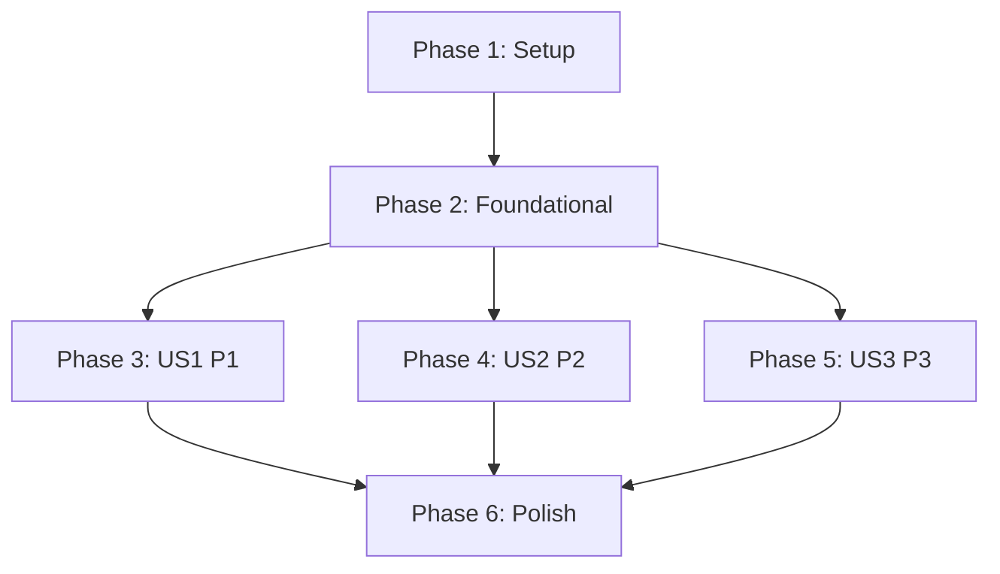

# Tasks: SonarCloud 报告问题修复优化

**Input**: 设计文档位于 `/home/dministrator/workspace/DDPlayTV/specs/001-fix-sonarcloud-issues/`  
**Prerequisites**: `/home/dministrator/workspace/DDPlayTV/specs/001-fix-sonarcloud-issues/plan.md`（必需）, `/home/dministrator/workspace/DDPlayTV/specs/001-fix-sonarcloud-issues/spec.md`（必需）, `/home/dministrator/workspace/DDPlayTV/specs/001-fix-sonarcloud-issues/research.md`, `/home/dministrator/workspace/DDPlayTV/specs/001-fix-sonarcloud-issues/data-model.md`, `/home/dministrator/workspace/DDPlayTV/specs/001-fix-sonarcloud-issues/contracts/quality-remediation.openapi.yaml`, `/home/dministrator/workspace/DDPlayTV/specs/001-fix-sonarcloud-issues/quickstart.md`

**Tests**: 本特性在 `spec.md`（FR-010）中明确要求“新增/修改逻辑必须补自动化测试”，因此每个 User Story 都包含先写测试任务。  
**Organization**: 任务按 User Story 分组，确保每个故事都可独立实现、独立验证与独立验收。

## Format: `[ID] [P?] [Story] Description`

- **[P]**: 可并行执行（不同文件、无未完成依赖）
- **[Story]**: 仅用于用户故事阶段（`[US1]`, `[US2]`, `[US3]`）
- 每条任务都必须包含明确文件路径

## Phase 1: Setup（共享初始化）

**Purpose**: 建立本次质量修复的目录、模板与执行入口

- [X] T001 创建质量修复证据总目录与索引文档 `specs/001-fix-sonarcloud-issues/evidence/README.md`
- [X] T002 [P] 创建基线导出脚本骨架与使用说明 `scripts/sonarcloud/export_baseline.py`
- [X] T003 [P] 创建修复台账模板（Issue/Task/Hotspot/Snapshot）`specs/001-fix-sonarcloud-issues/evidence/templates/remediation-ledger-template.md`
- [X] T004 [P] 创建执行日志模板（Gradle/Sonar/回归命令）`specs/001-fix-sonarcloud-issues/evidence/runlogs/command-log-template.md`
- [X] T005 创建修复任务总台账初始文件 `specs/001-fix-sonarcloud-issues/evidence/tracking/remediation_tasks.csv`

---

## Phase 2: Foundational（阻塞性前置）

**Purpose**: 完成质量门与数据流基础设施；未完成前禁止进入任一 User Story

**⚠️ CRITICAL**: 本阶段完成后，US1/US2/US3 才能开始

- [X] T006 在根构建脚本中新增 JaCoCo 聚合与报告任务 `./build.gradle.kts`
- [X] T007 [P] 在库模块统一配置 JaCoCo 与单测选项 `buildSrc/src/main/java/setup/Module.kt`
- [X] T008 [P] 在应用模块统一配置 JaCoCo 与单测选项 `buildSrc/src/main/java/setup/Application.kt`
- [X] T009 更新 SonarCloud CI 流水线以执行测试并上传覆盖率报告 `.github/workflows/sonarcloud.yml`
- [X] T010 [P] 配置 Sonar 覆盖率/重复率/排除项参数 `./sonar-project.properties`
- [X] T011 实现基线问题/热点/Top10 文件导出逻辑 `scripts/sonarcloud/export_baseline.py`
- [X] T012 [P] 实现基线与当前分析线对比脚本 `scripts/sonarcloud/compare_quality_snapshot.py`
- [X] T013 生成并固化基线快照与高风险清单 `specs/001-fix-sonarcloud-issues/evidence/baseline/quality-baseline.md`
- [X] T014 [P] 初始化第三方目录豁免台账 `specs/001-fix-sonarcloud-issues/evidence/tracking/exemptions.md`

**Checkpoint**: 质量门基础设施可运行，基线数据可追溯，用户故事可并行启动

---

## Phase 3: User Story 1 - 高风险问题优先收敛 (Priority: P1) 🎯 MVP

**Goal**: 先闭环漏洞与高风险热点，并显著压降高影响问题

**Independent Test**: 仅执行 US1 后，`specs/001-fix-sonarcloud-issues/evidence/us1/us1-snapshot.md` 必须可证明“漏洞清零 + 高风险热点完成处置 + 高影响问题相对基线显著下降”

### Tests for User Story 1（先写且先失败）

- [X] T015 [P] [US1] 为高风险热点修复新增单元测试 `bilibili_component/src/test/java/com/xyoye/common_component/bilibili/app/BilibiliTvClientSecurityTest.kt`
- [X] T016 [P] [US1] 为网络配置安全修复新增单元测试 `core_network_component/src/test/java/com/xyoye/common_component/network/config/ApiSecurityConfigTest.kt`
- [X] T017 [P] [US1] 为 NumberPicker 关键分支回归新增单元测试 `anime_component/src/test/java/com/xyoye/anime_component/ui/dialog/date_picker/NumberPickerBehaviorTest.kt`

### Implementation for User Story 1

- [X] T018 [US1] 修复高风险热点对应实现 `bilibili_component/src/main/java/com/xyoye/common_component/bilibili/app/BilibiliTvClient.kt`
- [X] T019 [US1] 修复高风险热点对应实现 `core_network_component/src/main/java/com/xyoye/common_component/network/config/Api.kt`
- [X] T020 [US1] 降低高影响复杂度并拆分控制流 `anime_component/src/main/java/com/xyoye/anime_component/ui/dialog/date_picker/NumberPicker.java`
- [X] T021 [US1] 记录 `/quality/issues` 与 `/quality/issues/{issueKey}/tasks` 的高风险映射台账 `specs/001-fix-sonarcloud-issues/evidence/us1/high-risk-task-map.md`
- [X] T022 [US1] 记录 `/quality/hotspots/{hotspotKey}/review` 的评审与处置证据 `specs/001-fix-sonarcloud-issues/evidence/us1/hotspot-review-log.md`
- [X] T023 [US1] 生成 `/quality/snapshots/compare` 的 US1 对比快照 `specs/001-fix-sonarcloud-issues/evidence/us1/us1-snapshot.md`
- [X] T024 [US1] 执行 US1 定向测试并记录结论 `specs/001-fix-sonarcloud-issues/evidence/us1/us1-test-log.md`

**Checkpoint**: US1 可独立验收（高风险闭环结果可追溯）

---

## Phase 4: User Story 2 - 高频问题文件集中治理 (Priority: P2)

**Goal**: 治理问题最多的 Top10 文件并保证核心用户路径不回归

**Independent Test**: 仅执行 US2 后，`specs/001-fix-sonarcloud-issues/evidence/us2/top10-delta.md` 需证明 Top10 问题总量下降（目标 >=30%），且核心路径回归记录完整

### Tests for User Story 2（先写且先失败）

- [X] T025 [P] [US2] 为播放控制高频问题回归新增单元测试 `player_component/src/test/java/com/xyoye/player_component/wrapper/ControlWrapperQualityRegressionTest.kt`
- [X] T026 [P] [US2] 为存储文件页高频问题回归新增单元测试 `storage_component/src/test/java/com/xyoye/storage_component/ui/activities/storage_file/StorageFileActivityQualityTest.kt`
- [X] T027 [P] [US2] 为 115 存储链路高频问题回归新增单元测试 `core_storage_component/src/test/java/com/xyoye/common_component/storage/cloud115/Cloud115StorageQualityTest.kt`
- [X] T028 [P] [US2] 为浏览/播放/搜索/设置核心路径新增仪表化冒烟测试 `app/src/androidTest/java/com/xyoye/app/quality/CorePathSmokeTest.kt`

### Implementation for User Story 2

- [X] T029 [US2] 修复 Top10 文件中的高频问题 `player_component/src/main/java/com/xyoye/player/wrapper/ControlWrapper.kt`
- [X] T030 [P] [US2] 修复 Top10 文件中的高频问题 `storage_component/src/main/java/com/xyoye/storage_component/ui/activities/storage_file/StorageFileActivity.kt`
- [X] T031 [P] [US2] 修复 Top10 文件中的高频问题 `player_component/src/main/java/com/xyoye/player/controller/video/PlayerControlView.kt`
- [X] T032 [P] [US2] 修复 Top10 文件中的高频问题 `player_component/src/main/java/com/xyoye/player/controller/video/InterControllerView.kt`
- [X] T033 [P] [US2] 修复 Top10 文件中的高频问题 `bilibili_component/src/main/java/com/xyoye/common_component/bilibili/repository/BilibiliRepositoryCore.kt`
- [X] T034 [P] [US2] 修复 Top10 测试文件中的重复与可维护性问题 `core_network_component/src/test/java/com/xyoye/common_component/network/open115/Open115ModelsMoshiTest.kt`
- [X] T035 [P] [US2] 修复 Top10 测试文件中的重复与可维护性问题 `player_component/src/test/java/com/xyoye/player_component/media3/Media3PlayerDelegateTest.kt`
- [X] T036 [P] [US2] 修复 Top10 测试文件中的重复与可维护性问题 `core_storage_component/src/test/java/com/xyoye/common_component/storage/cloud115/auth/Cloud115TokenParserTest.kt`
- [X] T037 [P] [US2] 修复 Top10 文件中的高频问题 `core_storage_component/src/main/java/com/xyoye/common_component/storage/impl/Cloud115Storage.kt`
- [X] T038 [P] [US2] 修复 Top10 资源文件中的重复与安全告警 `user_component/src/main/assets/bilibili/geetest_voucher.html`
- [X] T039 [US2] 生成 Top10 文件治理前后对比与问题归因表 `specs/001-fix-sonarcloud-issues/evidence/us2/top10-delta.md`
- [X] T040 [US2] 执行 US2 回归命令并记录核心路径结果 `specs/001-fix-sonarcloud-issues/evidence/us2/us2-test-log.md`

**Checkpoint**: US2 可独立验收（Top10 收敛 + 核心路径可用）

---

## Phase 5: User Story 3 - 修复结果可追踪与可验收 (Priority: P3)

**Goal**: 建立“问题-任务-评审-快照-豁免”全链路审计追踪

**Independent Test**: 仅执行 US3 后，可从 `specs/001-fix-sonarcloud-issues/evidence/us3/remediation-ledger.md` 按 issueKey 反查到处置状态、证据链接与最终验收结论

### Tests for User Story 3（先写且先失败）

- [X] T041 [P] [US3] 为基线导出结构校验新增脚本测试 `scripts/sonarcloud/tests/test_export_baseline.py`
- [X] T042 [P] [US3] 为快照阈值比较逻辑新增脚本测试 `scripts/sonarcloud/tests/test_compare_quality_snapshot.py`
- [X] T043 [P] [US3] 为修复台账字段与状态校验新增脚本测试 `scripts/sonarcloud/tests/test_validate_remediation_ledger.py`

### Implementation for User Story 3

- [X] T044 [US3] 实现修复台账校验器（对齐 QualityIssueItem/RemediationTaskItem/ExemptionRecord 规则）`scripts/sonarcloud/validate_remediation_ledger.py`
- [X] T045 [US3] 实现问题处置导出器（DEFER/ACCEPT_RISK/FALSE_POSITIVE/EXEMPT）`scripts/sonarcloud/export_issue_dispositions.py`
- [X] T046 [US3] 生成问题到任务到证据的审计总台账 `specs/001-fix-sonarcloud-issues/evidence/us3/remediation-ledger.md`
- [X] T047 [US3] 生成遗留高风险问题处置登记（理由/接受人/复核结论）`specs/001-fix-sonarcloud-issues/evidence/us3/high-risk-dispositions.md`
- [X] T048 [US3] 生成分支或 PR 分析线质量门对比快照 `specs/001-fix-sonarcloud-issues/evidence/us3/quality-gate-compare.md`
- [X] T049 [US3] 生成契约端点与 User Story 映射矩阵（覆盖 contracts 全部端点）`specs/001-fix-sonarcloud-issues/evidence/us3/contract-story-matrix.md`
- [X] T050 [US3] 执行最终验收命令并记录可追溯证据 `specs/001-fix-sonarcloud-issues/evidence/us3/final-acceptance-log.md`

**Checkpoint**: US3 可独立验收（全链路可追踪、可抽样复核）

---

## Phase 6: Polish & Cross-Cutting Concerns

**Purpose**: 收口跨故事事项，固化最终交付证据

- [X] T051 [P] 回填最终执行步骤与命令到交付快速指南 `specs/001-fix-sonarcloud-issues/quickstart.md`
- [X] T052 [P] 产出修复总结与残留风险说明 `specs/001-fix-sonarcloud-issues/evidence/final-summary.md`
- [X] T053 [P] 执行全量门禁并记录末尾 `BUILD SUCCESSFUL`/`BUILD FAILED` 结论 `specs/001-fix-sonarcloud-issues/evidence/final-gates.md`
- [X] T054 汇总最终质量指标快照（总问题/高影响/漏洞/热点/覆盖率/重复率）`specs/001-fix-sonarcloud-issues/evidence/final-snapshot.json`
- [X] T055 校验任务与证据一一对应并更新任务状态说明 `specs/001-fix-sonarcloud-issues/tasks.md`


### Phase 6 状态说明（T055）

- T051 -> `specs/001-fix-sonarcloud-issues/quickstart.md`（已回填最终执行步骤与命令）
- T052 -> `specs/001-fix-sonarcloud-issues/evidence/final-summary.md`（已产出修复总结与残留风险）
- T053 -> `specs/001-fix-sonarcloud-issues/evidence/final-gates.md`（已记录全量门禁与日志尾部结论）
- T054 -> `specs/001-fix-sonarcloud-issues/evidence/final-snapshot.json`（已汇总总问题/高影响/漏洞/热点/覆盖率/重复率）
- T055 -> `specs/001-fix-sonarcloud-issues/tasks.md`（任务与证据映射已校验并完成勾选）
- 当前待收尾风险：全量门禁仍有失败项，详见 `specs/001-fix-sonarcloud-issues/evidence/final-gates.md`

---

## Dependencies & Execution Order

### Phase Dependencies

- **Phase 1 (Setup)**: 无依赖，可立即开始
- **Phase 2 (Foundational)**: 依赖 Phase 1，且阻塞所有 User Story
- **Phase 3/4/5 (US1/US2/US3)**: 都依赖 Phase 2；建议按优先级推进（P1 → P2 → P3）
- **Phase 6 (Polish)**: 依赖所有目标 User Story 完成

### User Story Dependencies

- **US1 (P1)**: 仅依赖 Foundational，MVP 最小闭环
- **US2 (P2)**: 仅依赖 Foundational；可与 US1 并行，但推荐在 US1 后收敛以降低冲突
- **US3 (P3)**: 依赖 Foundational；建议在 US1/US2 产生稳定证据后执行

### Dependency Graph



### Within Each User Story

- 测试任务必须先落地并先失败，再进入实现任务
- 数据/台账（Issue/Task/Hotspot/Snapshot）先更新，再做验收快照
- 每个故事完成后先做独立验证，再推进下一个优先级故事

---

## Parallel Execution Examples

### Parallel Example: User Story 1

```bash
# 可并行：三个测试文件互不冲突
Task: "T015 [US1] bilibili_component/src/test/java/com/xyoye/common_component/bilibili/app/BilibiliTvClientSecurityTest.kt"
Task: "T016 [US1] core_network_component/src/test/java/com/xyoye/common_component/network/config/ApiSecurityConfigTest.kt"
Task: "T017 [US1] anime_component/src/test/java/com/xyoye/anime_component/ui/dialog/date_picker/NumberPickerBehaviorTest.kt"
```

### Parallel Example: User Story 2

```bash
# 可并行：Top10 文件分散在不同模块
Task: "T030 [US2] storage_component/src/main/java/com/xyoye/storage_component/ui/activities/storage_file/StorageFileActivity.kt"
Task: "T031 [US2] player_component/src/main/java/com/xyoye/player/controller/video/PlayerControlView.kt"
Task: "T037 [US2] core_storage_component/src/main/java/com/xyoye/common_component/storage/impl/Cloud115Storage.kt"
Task: "T038 [US2] user_component/src/main/assets/bilibili/geetest_voucher.html"
```

### Parallel Example: User Story 3

```bash
# 可并行：脚本测试相互独立
Task: "T041 [US3] scripts/sonarcloud/tests/test_export_baseline.py"
Task: "T042 [US3] scripts/sonarcloud/tests/test_compare_quality_snapshot.py"
Task: "T043 [US3] scripts/sonarcloud/tests/test_validate_remediation_ledger.py"
```

---

## Implementation Strategy

### MVP First（仅 US1）

1. 完成 Phase 1 + Phase 2
2. 完成 Phase 3（US1）
3. 验证 `specs/001-fix-sonarcloud-issues/evidence/us1/us1-snapshot.md`
4. 若满足高风险闭环，先做一次分支验收

### Incremental Delivery

1. Setup + Foundational 完成后，先交付 US1（风险下降）
2. 再交付 US2（问题集中区收敛 + 核心路径回归）
3. 最后交付 US3（审计追踪与最终验收）
4. 每个故事均可独立评审并形成阶段成果

### Parallel Team Strategy

1. 全员先完成 Phase 1/2
2. 然后按角色并行：
   - 开发 A：US1 高风险修复
   - 开发 B：US2 Top10 文件治理
   - 开发 C：US3 追踪脚本与台账
3. 以 `specs/001-fix-sonarcloud-issues/evidence/` 作为统一证据收敛目录

---

## Notes

- `[P]` 任务表示可并行执行，但必须避开同文件并发修改
- 所有故事均包含“独立验收标准”，避免跨故事耦合验收
- 契约端点已映射到 US1/US2/US3，对应产物在 `specs/001-fix-sonarcloud-issues/evidence/us*/`
- 第三方目录（`repository/*`）仅允许豁免登记，不进入实质修复任务
